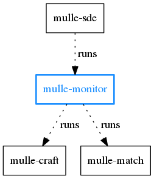
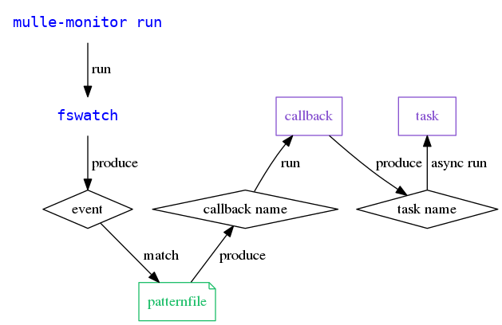

# mulle-monitor

🕵🏻‍ Extensible filesystem observation with callbacks


... for Linux, OS X, FreeBSD, Windows


**mulle-monitor** watches for the creation, deletion and updates of files
in the working directory (and its sub-directories) using
[fswatch](https://github.com/emcrisostomo/fswatch) or
[inotifywait](https://linux.die.net/man/1/inotifywait). It then
matches those filenames against a set of *patternfiles* to determine the
appropriate executable to call. The *type* of the patternfile is used as
a *callback*, which is then used to run a *task*.


#### Example

A patternfile defines with its filename (say `20-source1--all`) its *type*
(which  is "source1" in this case). The *callback*, a small script named
"source1-callback" runs `echo "filesystem"`. So mulle-monitor will run the
*filesystem* task.





Executable      | Description
----------------|--------------------------------
`mulle-monitor` | Observe changes in filesystem and react to them


## Install

See [mulle-sde-developer](//github.com/mulle-sde/mulle-sde-developer) how
to install mulle-sde.


## Commands


### mulle-monitor callback

Callbacks are triggered for every matching event. A callback should not use
much time. Preferably use it to select a task, which can be coalesced with
other events.

Add a *callback* for "hello":

```
cat <<EOF > my-callback.py
#!/usr/bin/env python
print "world"
EOF
mulle-monitor callback install hello my-callback.py
```

Remove a *callback*:

```
mulle-monitor callback remove hello
```

List all *callbacks*:

```
mulle-monitor callback list
```


### mulle-monitor task

A *task* is a bash script plugin. It needs to define a function
`<task>sde::reflect::task_run` to be a usable task plugin. Tasks are loaded into the
mulle-monitor and they must be able to coexist with other tasks.

Tasks can be long running. It is ensure that only one task runs at a given
time. Multiple callbacks in quick succession are coalesced into the run of
a single task.


Add a sourcable shell script as a for a task "world":

```
cat <<EOF > my-plugin.sh
world_task_run()
{
   echo "VfL Bochum 1848"
}
EOF
mulle-monitor task install world "my-plugin.sh"
```

Remove a *task* named "world":

```
mulle-monitor task remove world
```


List all *tasks*:

```
mulle-monitor task list
```


### mulle-monitor run

```
mulle-monitor run
```

`mulle-monitor run` observes the working directory and waits for filesystem
events.



If an incoming event can not be categorized as one of these three event types:
**create**, **update**, **delete** it is ignored.

The filename that generated the event is then classified using *patternfile*
matching (see [`mulle-monitor patternfile`](#mulle-monitor-patternfile) for
more information). By this classification the *type* and *category* of the
file are determined.

The *callback* will now be executed. As arguments it gets the event type
(e.g. **update**), the filename, and the *category* of the matching
*patternfile*.

The *callback* may produce a *task* name, by echoing it to stdout. If a
*task* name is produced, then this *task* is loaded by **mulle-monitor**
and executed.

> The [Wiki](https://github.com/mulle-sde/mulle-monitor/wiki)
> explains this also in much more detail.

> **mulle-monitor** comes with no predefined *patternfiles*, *callbacks*, or
> *tasks*.


### mulle-monitor find

> This command is forward to mulle-match.
> See [mulle_match](//github.com/mulle-sde/mulle-match) for a more detailed
> description.

This example lists all the files, that pass through *patternfiles* of type
"hello":

```
mulle-monitor find --match-filter "hello"
```

### mulle-monitor match

> This command is forward to mulle-match.
> See [mulle_match](//github.com/mulle-sde/mulle-match) for a more detailed
> description.

To test your installed *patternfile* you can use `mulle-monitor match`. It
will output the *callback* name if a file matches.

```
mulle-monitor match pix/foo.png
```

### mulle-monitor patternfile

> This command is forward to mulle-match.
> See [mulle_match](//github.com/mulle-sde/mulle-match) for a more detailed
> description.


Add a *patternfile* to select the *callback* "hello" for PNG files:

```
echo "*.png" > pattern.txt
mulle-monitor patternfile install hello pattern.txt
```

You can optionally specify a *category* for the patternfile, which will be
forwarded to the callback:

```
mulle-monitor patternfile install --category special hello pattern.txt
```

Remove a *patternfile*:

```
mulle-monitor patternfile remove hello
```

List all *patternfiles*:

```
mulle-monitor patternfile list
```

